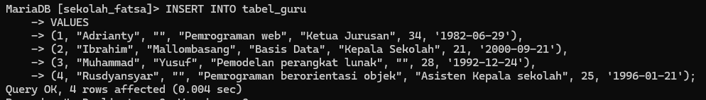
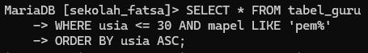
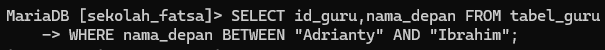

# soal 1
## Query

## Analisis
1. `CREATE TABLE tabel_guru`: Ini adalah pernyataan SQL untuk membuat sebuah tabel baru dengan nama "tabel_guru".
2. `id_guru INT(2) NOT NULL PRIMARY KEY`: Kolom "id_guru" adalah bilangan bulat (integer) dengan panjang maksimal 2 digit, tidak boleh bernilai NULL, dan bertindak sebagai primary key untuk tabel ini.
3. `nama_depan VARCHAR(50) NOT NULL UNIQUE`: Kolom "nama_depan" adalah string dengan panjang maksimal 50 karakter, tidak boleh bernilai NULL, dan harus bernilai unik (tidak boleh ada duplikat).
4. `nama_belakang VARCHAR(50) NOT NULL`: Kolom "nama_belakang" adalah string dengan panjang maksimal 50 karakter, tidak boleh bernilai NULL.
5. `mapel VARCHAR(50) NOT NULL`: Kolom "mapel" adalah string dengan panjang maksimal 50 karakter, tidak boleh bernilai NULL.
6. `jabatan VARCHAR(50) NOT NULL`: Kolom "jabatan" adalah string dengan panjang maksimal 50 karakter, tidak boleh bernilai NULL.
7. `usia INT(2) NOT NULL`: Kolom "usia" adalah bilangan bulat (integer) dengan panjang maksimal 2 digit, tidak boleh bernilai NULL.
8. `tanggal_lahir DATE NOT NULL`: Kolom "tanggal_lahir" adalah tipe data tanggal, tidak boleh bernilai NULL.
## Kesimpulan
Tabel `"tabel_guru"` ini dibuat untuk menyimpan data-data guru, termasuk informasi tentang nama depan, nama belakang, mata pelajaran yang diajar, jabatan, usia, dan tanggal lahir. Dengan menggunakan tipe data dan batasan yang tepat, tabel ini dapat membantu menjaga integritas dan konsistensi data guru di dalam sistem.

# soal 2
## Query

## Analisis
1. `INSERT INTO tabel_guru`: Pernyataan SQL ini digunakan untuk menambahkan data baru ke dalam tabel "tabel_guru".
2. `VALUES`: Kata kunci ini digunakan untuk menentukan nilai-nilai yang akan dimasukkan ke dalam tabel.
3. Setiap baris di dalam tabel `VALUES` mewakili satu data guru baru yang akan dimasukkan, dengan urutan sesuai dengan definisi kolom pada tabel.
4. Baris pertama: `(1, "Adrianty", "", "Pemrograman web", "Ketua Jurusan", 34, '1982-06-29')`:
    - `1`: ID guru dengan nilai 1.
    - `"Adrianty"`: Nama depan guru.
    - `""`: Nama belakang guru (kosong).
    - `"Pemrograman web"`: Mata pelajaran yang diajar.
    - `"Ketua Jurusan"`: Jabatan guru.
    - `34`: Usia guru.
    - `'1982-06-29'`: Tanggal lahir guru.
5. Baris-baris berikutnya mengikuti format yang sama, dengan data guru yang berbeda.
## Kesimpulan
Pernyataan `INSERT INTO` ini menambahkan 4 data baru ke dalam tabel "tabel_guru". Data-data ini meliputi informasi tentang ID guru, nama depan, nama belakang (jika ada), mata pelajaran yang diajar, jabatan, usia, dan tanggal lahir. Dengan memasukkan data-data ini,
# soal 3
## Query

## Analisis
1. `INSERT INTO tabel_guru`: Pernyataan SQL ini digunakan untuk menambahkan data baru ke dalam tabel "tabel_guru".
2. `VALUES`: Kata kunci ini digunakan untuk menentukan nilai-nilai yang akan dimasukkan ke dalam tabel.
3. Baris `(5, "Ayu", "Cantika", "Sistem Komputer", "guru", 25, '1998-12-29')` menambahkan satu data baru ke dalam tabel:
    - `5`: ID guru dengan nilai 5.
    - `"Ayu"`: Nama depan guru.
    - `"Cantika"`: Nama belakang guru.
    - `"Sistem Komputer"`: Mata pelajaran yang diajar.
    - `"guru"`: Jabatan guru.
    - `25`: Usia guru.
    - `'1998-12-29'`: Tanggal lahir guru.
## Kesimpulan
Pernyataan `INSERT INTO` ini menambahkan satu data baru ke dalam tabel "tabel_guru". Data baru ini mencakup informasi tentang ID guru, nama depan, nama belakang, mata pelajaran yang diajar, jabatan, usia, dan tanggal lahir. Dengan menambahkan data ini, tabel "tabel_guru" akan memiliki satu entri guru baru yang dapat digunakan dalam sistem.
# soal 4
## Query

## Analisis
1. `SELECT * FROM tabel_guru;`: Pernyataan SQL ini digunakan untuk menampilkan semua kolom dan baris dari tabel "tabel_guru".
2. `SELECT *` artinya memilih semua kolom dari tabel.
3. `FROM tabel_guru` menentukan bahwa data akan diambil dari tabel "tabel_guru".
## Kesimpulan
sistem akan menampilkan seluruh data yang tersimpan dalam tabel "tabel_guru".Ini memungkinkan Anda melihat seluruh daftar guru yang tersimpan dalam tabel.
# soal 5
## Query

## Analisis
1. `SELECT * FROM tabel_guru`: Ini memilih semua kolom dari tabel "tabel_guru".
2. `WHERE nama_depan = "Rusdyansyar"`: Ini menambahkan kondisi agar hanya menampilkan data di mana nilai kolom "nama_depan" sama dengan "Rusdyansyar".
## Kesimpulan
Dengan pernyataan yang benar, sistem akan menampilkan semua data dari tabel "tabel_guru" di mana nama depan guru adalah "Rusdyansyar".
# soal 6
## Query

## Analisis
1. `UPDATE tabel_guru`: Pernyataan SQL ini digunakan untuk memperbarui data yang ada dalam tabel "tabel_guru".
2. `SET nama_belakang = "Ganteng"`: Ini menentukan bahwa kolom "nama_belakang" akan diubah menjadi nilai "Ganteng" untuk data yang cocok dengan kondisi selanjutnya.
3. `WHERE id_guru = 3`: Kondisi ini memastikan bahwa hanya data dengan nilai "id_guru" sama dengan 3 yang akan diperbarui. Ini membatasi perubahan hanya pada entri guru tertentu.
## Kesimpulan
Pernyataan `UPDATE` ini akan mengubah nilai "nama_belakang" menjadi "Ganteng" untuk data guru yang memiliki "id_guru" bernilai 3 di dalam tabel "tabel_guru". Ini memungkinkan Anda untuk memperbarui informasi tertentu untuk data guru yang spesifik, tanpa mengubah data guru lainnya dalam tabel.
# soal 7
## Query

## Analisis
1. `DELETE FROM tabel_guru`: Pernyataan SQL ini digunakan untuk menghapus data dari tabel "tabel_guru".
2. `WHERE id_guru = 3`: Kondisi ini memastikan bahwa hanya data dengan nilai "id_guru" sama dengan 3 yang akan dihapus. Ini membatasi penghapusan hanya pada entri guru tertentu.
## Kesimpulan
Pernyataan `DELETE` ini akan menghapus baris data dari tabel "tabel_guru" di mana nilai "id_guru" sama dengan 3. Setelah pernyataan ini dijalankan, baris data untuk guru dengan ID 3 akan dihapus dari tabel. Ini memungkinkan Anda untuk menghapus data guru tertentu dari tabel tanpa mempengaruhi data guru lainnya.
# soal 8
## Query

## Analisis
1. `SELECT * FROM tabel_guru`: Ini memilih semua kolom dari tabel "tabel_guru".
2. `WHERE usia <= 30 AND mapel LIKE 'pem%'`: Ini menambahkan dua kondisi filter:
    - `usia <= 30`: Hanya menampilkan data guru dengan usia kurang dari atau sama dengan 30 tahun.
    - `mapel LIKE 'pem%'`: Hanya menampilkan data guru yang mengajar mata pelajaran yang dimulai dengan "pem" (misalnya "pemrograman", "pembukuan", dll.).
3. `ORDER BY usia ASC`: Ini mengurutkan hasil query berdasarkan kolom "usia" secara ascending (dari yang terkecil ke yang terbesar).
## Kesimpulan
Pernyataan SQL ini akan menampilkan semua data dari tabel "tabel_guru" di mana usia guru kurang dari atau sama dengan 30 tahun dan mengajar mata pelajaran yang dimulai dengan "pem". Data akan ditampilkan dalam urutan ascending berdasarkan usia guru.Ini memungkinkan Anda untuk mendapatkan daftar guru muda yang mengajar mata pelajaran tertentu, diurutkan dari yang paling muda.
# soal 9
## Query

## Analisis
1. `SELECT id_guru, nama_depan`: Ini memilih kolom "id_guru" dan "nama_depan" dari tabel.
2. `FROM tabel_guru`: Menentukan bahwa data akan diambil dari tabel "tabel_guru".
3. `WHERE nama_depan BETWEEN "Adrianty" AND "Ibrahim"`: Ini menambahkan kondisi filter untuk hanya menampilkan data di mana nilai kolom "nama_depan" berada di antara "Adrianty" dan "Ibrahim" (termasuk keduanya).
## Kesimpulan
Pernyataan SQL ini akan menampilkan ID guru dan nama depan untuk semua guru yang memiliki nama depan antara "Adrianty" dan "Ibrahim" (termasuk keduanya) yang tersimpan dalam tabel "tabel_guru".
Ini berguna jika Anda ingin mendapatkan daftar guru dengan nama depan tertentu, tanpa perlu mengetahui semua nama depan secara spesifik.
# soal 10
## Query

## Analisis
1. `SELECT CONCAT(nama_depan, ' ', nama_belakang) AS nama_lengkap`: Ini menggunakan fungsi `CONCAT()` untuk menggabungkan nilai kolom "nama_depan" dan "nama_belakang" dengan spasi di antaranya. Hasil gabungan ini akan ditampilkan dengan alias "nama_lengkap".
2. `FROM tabel_guru`: Menentukan bahwa data akan diambil dari tabel "tabel_guru".
## Kesimpulan
Pernyataan SQL ini akan menampilkan satu kolom bernama "nama_lengkap" yang berisi nama lengkap guru (nama depan dan nama belakang digabungkan) dari semua baris dalam tabel "tabel_guru".
Ini berguna jika Anda ingin menampilkan nama lengkap guru secara mudah, tanpa perlu menggabungkan kolom "nama_depan" dan "nama_belakang" secara manual.
# soal 11
## Query

## Analisis
1. `ALTER TABLE tabel_guru`: Ini menunjukkan bahwa perubahan akan dilakukan pada tabel "tabel_guru".
2. `ADD COLUMN status ENUM('PNS', 'PPPK', 'Honorer') NOT NULL`: Ini menambahkan sebuah kolom baru bernama "status" ke tabel "tabel_guru". Tipe data kolom ini adalah ENUM, yang berarti hanya salah satu dari tiga nilai yang ditentukan ('PNS', 'PPPK', 'Honorer') yang dapat dimasukkan. Juga, kolom ini ditandai sebagai NOT NULL, artinya setiap baris harus memiliki nilai terisi untuk kolom ini.
## Kesimpulan
Pernyataan SQL ini akan menambahkan sebuah kolom baru bernama "status" ke tabel "tabel_guru". Kolom ini akan menyimpan informasi status kepegawaian guru, yang dapat berupa 'PNS', 'PPPK', atau 'Honorer'. Setiap baris dalam tabel harus memiliki nilai yang diisi untuk kolom ini.
# soal 12
## Query

## Analisis
1. `SELECT nama_depan, MAX(usia) AS usia_tertua`: Ini memilih dua kolom: "nama_depan" dan nilai maksimum dari kolom "usia" yang akan ditampilkan dengan alias "usia_tertua".
2. `FROM tabel_guru`: Menentukan bahwa data akan diambil dari tabel "tabel_guru".
## Kesimpulan
Ini berguna jika Anda ingin mengetahui usia tertua guru dalam tabel tersebut. Perlu diperhatikan bahwa hasil hanya akan menampilkan satu baris, karena fungsi `MAX()` akan mengembalikan nilai usia tertua secara keseluruhan.