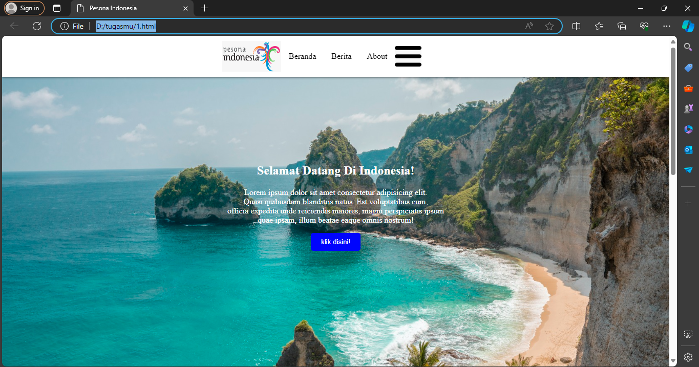
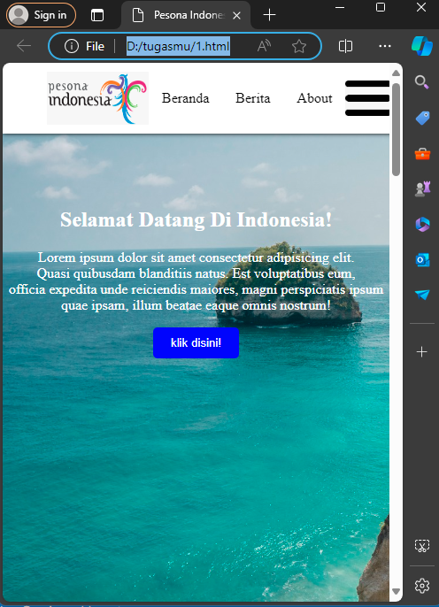

# kode program
## html
```html
<!DOCTYPE html>
<html>
<head>
    <title>Pesona Indonesia</title>
    <meta name="viewport" content="width=device-width, initial-scale=1.0">
    <link rel="stylesheet" href="style.css">
</head>
<body>
    <nav class="navbar">
        
        <p>Beranda</p>
        <p>Berita</p>
        <p>About</p>
        
    </nav>
  <div class="background">
        <div class="tex">
            <h2>Selamat Datang Di Indonesia!</h2>
            <p>Lorem ipsum dolor sit amet consectetur adipisicing elit. <br> Quasi quibusdam blanditiis natus.
                Est voluptatibus eum, <br> officia expedita unde reiciendis maiores,
                magni perspiciatis ipsum <br>quae ipsam, illum beatae eaque omnis nostrum!
            </p>
            <input class="button" type="button" value="klik disini!">
        </div>
    </div>
    <h2 align="center">Berita</h2>
    <div class="container">
        <div class="box">
            
            <h3>Pantai Kuta</h3>
            <p>Lorem ipsum dolor sit amet consectetur adipisicing elit. Consectetur sequi officia est molestiae
                architecto veniam non. Nesciunt possimus iure perferendis cupiditate sapiente consectetur,
                at eligendi incidunt animi sit. Expedita, aliquid!
            </p>
            <input class="tombol" type="button" value="Baca Selengkapnya >>>">
        </div>
        <div class="box">
            
            <h3>Kebun Tetta</h3>
            <p>Lorem ipsum dolor sit amet consectetur adipisicing elit. Consectetur sequi officia est molestiae
                architecto veniam non. Nesciunt possimus iure perferendis cupiditate sapiente consectetur,
                at eligendi incidunt animi sit. Expedita, aliquid!
            </p>
            <input class="tombol" type="button" value="Baca Selengkapnya >>>">
        </div>
        <div class="box">
            
            <h3>Gunung Bromo</h3>
            <p>Lorem ipsum dolor sit amet consectetur adipisicing elit. Consectetur sequi officia est molestiae
                architecto veniam non. Nesciunt possimus iure perferendis cupiditate sapiente consectetur,
                at eligendi incidunt animi sit. Expedita, aliquid!
            </p>
            <input class="tombol" type="button" value="Baca Selengkapnya >>>">
        </div>
        <div class="box">
            
            <h3>Jekadah!</h3>
            <p>Lorem ipsum dolor sit amet consectetur adipisicing elit. Consectetur sequi officia est molestiae
                architecto veniam non. Nesciunt possimus iure perferendis cupiditate sapiente consectetur,
                at eligendi incidunt animi sit. Expedita, aliquid!
            </p>
            <input class="tombol" type="button" value="Baca Selengkapnya >>>">
        </div>
    </div>    
    <div class="end">
        
        <div class="text">
            <h3 id="jd">About</h3>
            <p>Lorem ipsum, dolor sit amet consectetur adipisicing elit.
                 Est reiciendis nostrum quisquam, quae ea dolorem obcaecati, <br>
                 quia ipsam quam architecto asperiores hic eaque odio numquam optio quo.
                 Sed, dolorum quidem. <br> Lorem ipsum dolor sit amet consectetur adipisicing elit.
                  Libero, minus? Ut rerum suscipit explicabo accusamus fugiat soluta aperiam <br>aliquam doloremque tempora inventore.
                  Adipisci eveniet officia nesciunt amet quo pariatur accusamus.
            </p>
            <p><b>Perhatikan ini gambar di samping, di kasih hitam putihki ini..</b></p>
        </div>
    </div>
</body>
</html>
```

## css
```css
body {
    margin: 0;
    padding: 0;
}
.navbar {
    display: flex;
    position: fixed;
    margin-bottom: 500px;
    background-color: white;
    padding-right: 100%;
    justify-content: center;
    box-shadow: 0px 0px 5px 0px;
    z-index: 99;
}
.navbar > img.logo {
    width: auto;
    height: 60px;
    margin-left: 30px;
    margin-right: auto;
    padding-left: 400px;
    padding-top: 10px;
    padding-bottom: 10px;
    width: 115px;
}
.navbar p {
    padding: 15px;
    cursor: pointer;
    transition: 0.8s all;
}
.navbar p:hover {
    transform: scale(1.3);
}
.navbar p:active {
    transform: scale(0.8);
}
.navbar img.garis {
    margin-left: auto;
    padding-right: 30px;
    padding-top: 20px;
    padding-bottom: 10px;
    height: 40px;
}
@media only screen and (max-width: 768px) {
.navbar {
    padding-right: 20px;
    }
.navbar > img.logo {
    padding-left: 20px;
    }
}
.background {
    background-image: url(img2.jpg);
    background-size: cover;
    padding-top: 100px;
    height: 600px;
    text-align: center;
    width:100%;
}
.button {
    background-color: blue;
    color: white;
    padding: 10px 20px;
    border-radius: 5px;
    cursor: pointer;
    border: none;
}
.button:hover {
    background-color: white;
    color: navy;
}
.tex {
    color: white;
    padding-top: 10%;
    padding-bottom: 20px; 
 }
.container {
     display: flex;
    flex-wrap: wrap;
    justify-content: center;
}
.box {
    border: 1px black;
    border-radius: 10px;
    box-shadow: 2px 2px 2px 2px;
    background-color: white;
    width: 250px;
    height: 450px;
    margin: 20px;
}
.gambar {
    margin-top: 20px;
    width: 220px;
    height: 150px;
    padding-left: 15px;
    border-radius: 30px;
}
.tombol {
    background-color: blue;
    color: white;
    margin: 20px;
    height: 40px;
    border: none;
    border-radius: 5px;
    cursor: pointer;
}
.tombol:hover {
    background-color: navy;
    color: white;
}
.end {
    background-color: blue;
    color: white;
    height: 300px;
    display: flex;
    align-items: center;
    text-align: center;
}
#border {
    width: 200px;
    height: 200px;
    border-radius: 100px;
    margin: 20px;
    filter: grayscale(100);
}
#jd {
    text-align: center;
}
.text {
    margin-top: 40px;
    margin-left: 10px;
    display: flex;
    flex-direction: column;
}
@media (max-width: 600px) {
.end {
    flex-direction: column;
    height: auto;
}
#border {
    margin: 10px auto;
}
.text {
margin-top: 20px;
}
    }
```
# hasil



# analisis
## html
- `<!DOCTYPE html>`: Ini adalah deklarasi tipe dokumen untuk menunjukkan bahwa halaman ini menggunakan standar HTML.
- `<html>`: Tag pembuka untuk elemen root dari halaman HTML.
- `<head>`: Bagian ini berisi informasi tentang halaman seperti judul (dalam tag `<title>`), viewport (dalam tag `<meta>`), dan referensi ke file CSS (dalam tag `<link>`).
- `<title>Pesona Indonesia</title>`: Ini adalah judul halaman yang akan ditampilkan di tab browser.    
- `<meta name="viewport" content="width=device-width, initial-scale=1.0">`: Tag `<meta>` ini memberi instruksi kepada peramban tentang cara menampilkan halaman pada berbagai perangkat dengan lebar viewport yang sesuai.
- `<link rel="stylesheet" href="style.css">`: Ini adalah tag untuk menghubungkan file CSS eksternal bernama "style.css" ke halaman HTML.
- `<body>`: Tag ini berisi semua konten yang akan ditampilkan di halaman web.
- `<nav class="navbar">...</nav>`: Ini adalah elemen navigasi yang berisi logo, tautan, dan elemen lainnya. Kelas "navbar" digunakan untuk menentukan styling dari elemen navigasi ini.
- ``: Ini adalah elemen gambar dengan atribut `src` yang menunjukkan sumber gambar, `alt` untuk teks alternatif, dan kelas "logo" untuk styling.
- `<p>Beranda</p>`, `<p>Berita</p>`, `<p>About</p>`: Ini adalah elemen teks paragraf yang berisi tautan navigasi.
- ``: Ini adalah elemen gambar lainnya dengan sumber, teks alternatif, dan kelas "garis" untuk styling.    
- `<div class="background">...</div>`: Ini adalah div utama yang memiliki kelas "background" untuk memberikan latar belakang pada bagian ini.
- `<div class="tex">...</div>`: Ini adalah div yang berisi teks dan tombol untuk konten utama di dalam div "background".
- `<h2>Selamat Datang Di Indonesia!</h2>`, `<p>Lorem ipsum dolor sit amet consectetur adipisicing elit...</p>`, `<input class="button" type="button" value="klik disini!">`: Ini adalah elemen teks, paragraf, dan tombol.
- `<h2 align="center">Berita</h2>`: Ini adalah elemen teks heading level 2 dengan atribut `align` yang mengatur perataan teks menjadi tengah.
- `<div class="container">...</div>`: Ini adalah div yang berisi kotak-kotak berita.
- `<div class="box">...</div>`: Ini adalah div yang mewakili setiap kotak berita dengan gambar, judul, paragraf, dan tombol.
- ``: Ini adalah elemen gambar dengan kelas "gambar" dan atribut `src` yang menunjukkan sumber gambar.
- `<h3>Pantai Kuta</h3>`: Ini adalah elemen teks heading level 3 yang menunjukkan judul berita.
- `<p>Lorem ipsum dolor sit amet consectetur adipisicing elit...</p>`: Ini adalah elemen paragraf yang berisi isi berita.
- `<input class="tombol" type="button" value="Baca Selengkapnya >>>">`: Ini adalah elemen tombol dengan kelas "tombol" dan teks "Baca Selengkapnya >>>".
- `<div class="end">...</div>`: Ini adalah div terakhir yang berisi gambar dan teks di bagian bawah halaman.
- ``: Ini adalah elemen gambar dengan atribut `id` untuk mengidentifikasinya dan atribut `src` yang menunjukkan sumber gambar.
- `<div class="text">...</div>`: Ini adalah div yang berisi teks di bagian bawah halaman.
- `<h3 id="jd">About</h3>`: Ini adalah elemen teks heading level3 dengan atribut `id` yang mengidentifikasinya.
- `<p>Lorem ipsum, dolor sit amet consectetur adipisicing elit...</p>`: Ini adalah elemen paragraf yang berisi isi teks.
- `<p><b>Perhatikan ini gambar di samping, di kasih hitam putihki ini..</b></p>`: Ini adalah elemen paragraf yang berisi teks yang ditebalkan dengan menggunakan tag `<b>`.

## css
- `body`: Selector ini mengarah pada elemen `<body>` pada halaman HTML. Ini mengatur margin dan padding menjadi 0, sehingga menghilangkan ruang kosong default di sekitar elemen body.
- `.navbar`: Selector ini mengarah pada elemen dengan kelas "navbar" dan menerapkan gaya untuk membuat bilah navigasi. Ini menggunakan flexbox (`display: flex;`) untuk tata letak, mengatur posisi secara tetap (`position: fixed;`), mengatur warna latar belakang menjadi putih, menambahkan bayangan kotak, dan mengatur z-index menjadi 99 agar muncul di atas elemen lain.
- `.navbar > img.logo`: Selector ini mengarah pada elemen gambar dengan kelas "logo" yang merupakan anak langsung dari elemen dengan kelas "navbar". Ini mengatur berbagai gaya untuk gambar logo, termasuk lebar, tinggi, margin, dan padding.
- `.navbar p`: Selector ini mengarah pada elemen `<p>` di dalam navbar dan menerapkan padding dan gaya kursor. Selain itu, ia menentukan efek transisi selama 0,8 detik saat mengarahkan kursor pada paragraf.
- `.navbar p:hover` dan `.navbar p:active`: Selector ini mendefinisikan gaya untuk elemen `<p>` di dalam navbar saat sedang diarahkan kursor atau diaktifkan (diklik), masing-masing. Ini menerapkan transformasi skala untuk menciptakan efek zoom-in. 
- `.navbar img.garis`: Selector ini mengarah pada elemen gambar dengan kelas "garis" di dalam navbar dan menerapkan gaya seperti margin dan padding. 
- `@media only screen and (max-width: 768px)`: Media query ini mengarah pada layar dengan lebar maksimum 768 piksel. Ini mengganti beberapa gaya di dalam navbar dan logo ketika ukuran layar lebih kecil, menyesuaikan nilai padding. 
- `.background`: Selector ini mengarah pada elemen dengan kelas "background" dan mengatur gambar latar belakang, ukuran latar belakang, padding, tinggi, dan lebar. 
- `.button`: Selector ini mengarah pada elemen dengan kelas "button" dan menerapkan gaya seperti warna latar belakang, warna teks, padding, radius batas, dan kursor. Selain itu, ia menentukan warna latar belakang dan warna teks yang berbeda saat diarahkan.
- `.tex`: Selector ini mengarah pada elemen dengan kelas "tex" dan mengatur gaya untuk warna teks dan padding.
- `.container`: Selector ini mengarah pada elemen dengan kelas "container" dan menerapkan gaya flexbox untuk membuat wadah dengan item terlipat dan justifikasi yang terpusat.
- `.box`: Selector ini mengarah pada elemen dengan kelas "box" dan mengatur gaya untuk batas, radius batas, bayangan kotak, warna latar belakang, lebar, tinggi, dan margin.
- `.gambar`: Selector ini mengarah pada elemen dengan kelas "gambar" dan mengatur gaya seperti margin, lebar, tinggi, padding, dan radius batas.
- `.tombol`: Selector ini mengarah pada elemen dengan kelas "tombol" dan menerapkan gaya seperti warna latar belakang, warna teks, margin, tinggi, batas, radius batas, dan kursor. Selain itu, ia menentukan warna latar belakang dan warna teks yang berbeda saat diarahkan.
- `.end`: Selector ini mengarah pada elemen dengan kelas "end" dan mengatur gaya seperti warna latar belakang, warna teks, tinggi, tampilan, penyejajaran, dan penyejajaran teks.
- `#border`: Selector ini mengarah pada elemen dengan ID "border" dan mengatur gaya untuk lebar, tinggi, radius batas, margin, dan filter keabuan.  
- `#jd`: Selector ini mengarah pada elemen dengan ID "jd" dan mengatur penyejajaran teks menjadi tengah.
- `.text`: Selector ini mengarah pada elemen dengan kelas "text" dan menerapkan gaya seperti margin, tampilan, dan arah fleks.  
- `@media (max-width: 600px)`: Media query ini mengarah pada layar dengan lebar maksimum 600 piksel. Ini mengganti beberapa gaya di dalam elemen dengan kelas "end" dan "border" ketika ukuran layar lebih kecil, mengatur penataan ulang elemen dan mengubah margin.
